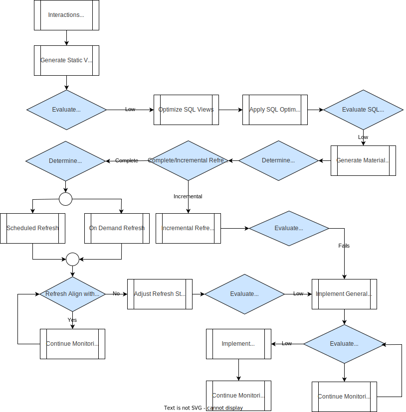

# SQL- Execution Lifecycle Performance Optimization and Data Management Guide

## Overview

This document provides a detailed guide for ensuring effective data presentation, optimization, and performance monitoring within a PostgreSQL environment. It begins by defining the purpose and requirements for data presentation based on business needs, including steps for creating and optimizing static SQL views, and utilizing materialized views and Incremental View Maintenance (IVM) to enhance performance. The guide covers generalized and specific physical table denormalization strategies to improve query efficiency and simplify data access.

Performance monitoring and optimization are addressed through a variety of tools and techniques, including pgAdmin, Prometheus, Grafana, and cloud-based solutions like Datadog and AWS CloudWatch. The document also outlines a systematic approach to collecting and analyzing performance data, monitoring query execution, and optimizing database resources.

Data accuracy and integrity are ensured through a structured process of quality checks, consistency validation, automated testing, and anomaly resolution. Additionally, it emphasizes the importance of documenting changes, gathering stakeholder feedback, and providing ongoing maintenance and support.

Finally, it details the development of actionable performance improvement plans, including query optimization, resource allocation, and scaling strategies to meet increasing demands and ensure sustained database efficiency. This comprehensive approach aims to address performance issues proactively and support continuous improvement in database management and data presentation.

**Diagrams Included:**
1. [**Data Optimization**](#data-optimization-process): Illustrates the process of optimizing data presentation, including static SQL views, materialized views, and denormalization strategies.
2. [**Data Optimization Performance Monitoring**](#performance-monitoring-process): Details the tools and techniques for evaluating query performance, indexing, and system resource utilization.

## Purpose and Requirement for Data Presentation (Business Requirement)
- Define the purpose and requirement for the presentation of data based on business needs.
- Ensure data is presented in a way that meets the expectations and requirements of stakeholders.

### Steps for Data Presentation

#### 1. Prepare Static SQL Views
- Create static SQL views from the underlying data model (Data Vault).
- Ensure these views accurately represent the data required for analysis and reporting.

#### 2. Optimize SQL Views
- If SQL views are slow, optimize them using standard SQL optimization techniques.
  - Techniques include indexing, query rewriting, and proper join strategies.

#### 3. Create Materialized Views
- If SQL views are still slow after optimization, create materialized views based on performance requirements.
- Use materialized views to store precomputed results for faster data retrieval.

#### 4. Incremental View Maintenance (IVM)
- If materialized views cannot be properly refreshed incrementally, consider using Incremental View Maintenance (IVM).
- IVM helps to maintain materialized views efficiently by only refreshing the changed parts.

#### 5. Generalized Physical Table Denormalization
- Generalize physical table denormalization into satellite tables if possible.
- This helps in improving query performance and simplifies data access.

#### 6. Specific Physical Table Denormalization
- If generalization is not possible, perform specific physical table denormalization into satellites tied to business requirements.
- Ensure the denormalization meets the specific needs of the business use case.

## Database Performance Monitoring and Optimization

### Tools for Monitoring and Optimizing Database Performance

#### 1. Monitor Generalized Physical Table Performance
- **Tools**:
  - **pgAdmin**: For monitoring query performance and visualizing execution plans.
  - **Prometheus & Grafana**: For real-time performance metrics collection and visualization.
  - **Datadog/New Relic**: For detailed performance metrics and real-time alerts.
  - **AWS CloudWatch/Azure Monitor**: For cloud-specific monitoring and alerting.
  - **pg_stat_statements**: To collect and analyze execution statistics of queries.
  - **pgBadger**: To analyze PostgreSQL logs and generate detailed performance reports.
  - **Elastic Stack (ELK Stack)**: Centralized logging and performance analysis.
  - **pgTune**: Adjust PostgreSQL configurations based on performance needs.

#### 2. Monitor Specific Denormalized Table Performance
- **Metrics to Evaluate**:
  - **Query Execution Time**: Measure how long queries take to execute.
  - **Index Efficiency**: Assess the effectiveness of indexes.
  - **Resource Utilization**: Check CPU, memory, and I/O usage.
  - **Data Retrieval Speed**: Determine how quickly data can be retrieved.

#### 3. Scheduled Refresh and On-Demand Refresh Monitoring
- **Tools**:
  - pgAdmin, Prometheus, Grafana, Datadog, New Relic, AWS CloudWatch, Azure Monitor.
- **Actions**:
  - **Schedule and Implement Refresh Jobs**.
  - **Execute On-Demand Refresh**.
  - **Monitor Refreshes**:
    - Scheduled Refresh Tools: pgAdmin, Prometheus & Grafana, Datadog/New Relic, AWS CloudWatch/Azure Monitor.
    - On-Demand Refresh Tools: pgAdmin, Prometheus & Grafana, Datadog/New Relic, AWS CloudWatch/Azure Monitor.
  - **Collect Performance Data**:
    - Tools: pg_stat_statements, pgBadger.
    - Action: Collect and analyze performance data from refresh operations.

### Tools for Monitoring and Analyzing Database Performance

#### 1. [pgAdmin](https://www.pgadmin.org/)
- **Description**: A comprehensive open-source administration and management tool for PostgreSQL.
- **Features**: 
  - Query performance analysis.
  - Server and database monitoring.
  - Visual explain plans.
  - Real-time query monitoring.

#### 2. [pg_stat_statements](https://www.postgresql.org/docs/current/pgstatstatements.html)
- **Description**: PostgreSQL extension that tracks execution statistics of all SQL statements executed by a server.
- **Features**:
  - Provides detailed information about query execution times, number of calls, and I/O statistics.
  - Helps identify slow queries and bottlenecks.

#### 3. [pgBadger](https://github.com/2ndQuadrant/pgbadger)
- **Description**: A fast PostgreSQL log analyzer built for speed with fully detailed reports.
- **Features**:
  - Parses PostgreSQL log files and generates performance reports.
  - Provides insights into query performance, errors, and server activity.

#### 4. [Prometheus](https://prometheus.io/) and [Grafana](https://grafana.com/)
- **Description**: Prometheus is an open-source systems monitoring and alerting toolkit, and Grafana is an open-source platform for monitoring and observability.
- **Features**:
  - Real-time monitoring and visualization.
  - Integration with PostgreSQL Exporter to collect database metrics.
  - Customizable dashboards and alerting.

#### 5. [Datadog](https://www.datadoghq.com/)
- **Description**: A cloud-based monitoring and analytics platform.
- **Features**:
  - Comprehensive monitoring for databases, servers, applications, and services.
  - Customizable dashboards and alerting.
  - Integration with PostgreSQL for performance metrics.

#### 6. [New Relic](https://newrelic.com/)
- **Description**: A cloud-based observability platform for monitoring and troubleshooting.
- **Features**:
  - Detailed performance insights for databases.
  - Custom dashboards and alerts.
  - Integration with PostgreSQL for tracking query performance and database health.

#### 7. [AWS CloudWatch](https://aws.amazon.com/cloudwatch/) (for AWS users)
- **Description**: A monitoring and observability service provided by AWS.
- **Features**:
  - Real-time monitoring of AWS resources and applications.
  - Detailed PostgreSQL performance metrics (if using Amazon RDS for PostgreSQL).
  - Customizable dashboards and alerting.

#### 8. [Azure Monitor](https://azure.microsoft.com/en-us/services/monitor/) (for Azure users)
- **Description**: A monitoring service for collecting and analyzing data from Azure resources.
- **Features**:
  - Real-time monitoring of Azure resources and applications.
  - Integration with Azure Database for PostgreSQL.
  - Customizable dashboards and alerting.

#### 9. [Elastic Stack (ELK Stack)](https://www.elastic.co/what-is/elk-stack)
- **Description**: A suite of tools including Elasticsearch, Logstash, and Kibana.
- **Features**:
  - Centralized logging and performance analysis.
  - Real-time search and analytics.
  - Customizable dashboards and visualizations.

#### 10. [pgTune](https://pgtune.leopard.in.ua/)
- **Description**: A tool that helps to generate optimal PostgreSQL configuration based on the system's hardware and workload.
- **Features**:
  - Provides configuration recommendations.
  - Helps to optimize PostgreSQL performance settings.

### SQL DB Design Checklist

For a comprehensive overview of best practices in SQL database design, including detailed recommendations on data types, indexing, normalization, and query optimization, please visit the [SQL DB Design Checklist](https://www.sql-aide.com/dcp/sql/sql-db-design-checklist/). This resource provides valuable insights to enhance your database schema and performance.

#### Summary

By leveraging these tools and following the best practices outlined in the SQL DB Design Checklist, we can thoroughly analyze and monitor the performance of the database, ensuring it meets business requirements and performs efficiently. Regular monitoring and analysis help in identifying and addressing performance issues proactively.

---

### Validate Data Accuracy and Integrity

#### 1. Identify Data Quality Metrics
- **Action**: Define metrics and criteria for data quality that are relevant to the business needs. These may include accuracy, completeness, consistency, timeliness, and validity.
- **Examples**: Validating unique constraints, checking for null values in critical columns, ensuring referential integrity.

#### 2. Implement Data Quality Checks
- **Action**: Set up automated data quality checks to ensure data adheres to defined quality metrics.
- **Tools**: SQL scripts, ETL tools (e.g., Talend, Informatica), data quality tools (e.g., Talend Data Quality, Apache Griffin).

#### 3. Perform Data Consistency Checks
- **Action**: Ensure data consistency across different tables and sources. This includes checking for synchronization between denormalized tables and their source tables.
- **Tools**: SQL queries, data integration tools (e.g., Apache NiFi).

#### 4. Conduct Data Reconciliation
- **Action**: Reconcile data to verify that the data in the denormalized tables matches the original source data.
- **Tools**: SQL queries, data comparison tools (e.g., Beyond Compare, WinMerge).

#### 5. Run Automated Tests
- **Action**: Execute automated tests to validate the data integrity and accuracy.
- **Tools**: pgTAP (for PostgreSQL), unit testing frameworks, CI/CD pipelines.

#### 6. Review Anomalies and Discrepancies
- **Action**: Analyze any anomalies or discrepancies found during data validation and testing. Determine their root cause.
- **Tools**: SQL queries, data analysis tools (e.g., Tableau, Power BI).

#### 7. Correct Data Issues
- **Action**: Fix identified data issues and revalidate to ensure the corrections are effective.
- **Tools**: SQL scripts, ETL tools, data repair tools.

#### 8. Document Data Validation Process
- **Action**: Document the data validation process, including the tests performed, tools used, and any issues found and resolved.
- **Purpose**: Provides a reference for future validations and audits.

#### 9. Test Query Performance
- **Action**: Execute and test queries to ensure they perform well after data validation.
- **Tools**: SQL queries, performance testing tools (e.g., pgBench, JMeter).

#### 10. Update and Optimize Queries and Views
- **Action**: Based on the performance tests, update and optimize queries and views as needed.
- **Purpose**: Ensures that the queries are efficient and meet performance requirements.

#### 11. Monitor System Performance
- **Action**: Continuously monitor the system performance to identify and address any new issues.
- **Tools**: pgAdmin, Prometheus & Grafana, Datadog, New Relic, AWS CloudWatch, Azure Monitor.

#### 12. Gather Feedback from Stakeholders
- **Action**: Collect feedback from stakeholders to ensure that the data presentation meets their expectations and requirements.
- **Purpose**: Ensures stakeholder satisfaction and continuous improvement.

#### 13. Document Changes
- **Action**: Keep detailed records of any changes made to the data structures, queries, and processes.
- **Purpose**: Provides a historical record and assists in troubleshooting and audits.

#### 14. Review and Refine
- **Action**: Regularly review and refine the data presentation process to enhance its efficiency and effectiveness.
- **Purpose**: Ensures continuous improvement.

#### 15. Maintain and Support
- **Action**: Provide ongoing maintenance and support for the data presentation system.
- **Purpose**: Ensures the system remains functional and performs well over time.

#### Summary

By following these steps, we can ensure the data's accuracy and integrity, thereby providing reliable and high-quality data to stakeholders.

---

### Process and Steps

#### Step 1: Identify Data Quality Metrics
- Define data quality metrics relevant to business needs.
- Examples: Validating unique constraints, checking for null values, ensuring referential integrity.

#### Step 2: Implement Data Quality Checks
- Set up automated data quality checks.
- Tools: SQL scripts, ETL tools, data quality tools.

#### Step 3: Perform Data Consistency Checks
- Ensure data consistency across different tables and sources.
- Tools: SQL queries, data integration tools.

#### Step 4: Conduct Data Reconciliation
- Verify data in denormalized tables matches the original source data.
- Tools: SQL queries, data comparison tools.

#### Step 5: Run Automated Tests
- Execute automated tests to validate data integrity and accuracy.
- Tools: pgTAP, unit testing frameworks, CI/CD pipelines.

#### Step 6: Review Anomalies and Discrepancies
- Analyze anomalies or discrepancies and determine root cause.
- Tools: SQL queries, data analysis tools.

#### Step 7: Correct Data Issues
- Fix identified data issues and revalidate.
- Tools: SQL scripts, ETL tools, data repair tools.

#### Step 8: Document Data Validation Process
- Document tests performed, tools used, issues found and resolved.
- Purpose: Reference for future validations and audits.

#### Step 9: Test Query Performance
- Execute and test queries for performance.
- Tools: SQL queries, performance testing tools.

#### Step 10: Update and Optimize Queries and Views
- Update and optimize queries based on performance tests.
- Purpose: Ensure efficient queries that meet performance requirements.

#### Step 11: Monitor System Performance
- Continuously monitor system performance.
- Tools: pgAdmin, Prometheus & Grafana, Datadog, New Relic, AWS CloudWatch, Azure Monitor.

#### Step 12: Gather Feedback from Stakeholders
- Collect feedback from stakeholders on data presentation.
- Purpose: Ensure stakeholder satisfaction and continuous improvement.

#### Step 13: Document Changes
- Record changes made to data structures, queries, and processes.
- Purpose: Historical record and aid in troubleshooting and audits.

#### Step 14: Review and Refine
- Regularly review and refine data presentation process.
- Purpose: Continuous improvement.

#### Step 15: Maintain and Support
- Provide ongoing maintenance and support for data presentation system.
- Purpose: Ensure system remains functional and performs well.

#### Summary

By following these steps, ensure data accuracy and integrity, providing reliable data to stakeholders.

---

## Performance Improvement Plan

#### Generalized Physical Table Performance

1. **Monitor Current Performance**
   - **Action:** Regularly check the performance of tables and queries.
   - **Tools:** pgAdmin, Prometheus & Grafana.

2. **Analyze Query Patterns**
   - **Action:** Understand how tables are queried to identify performance bottlenecks.
   - **Tools:** pg_stat_statements, pgBadger.

3. **Review Table Schema**
   - **Action:** Ensure that the table design is optimized for current use cases.
   - **Examples:** Check for normalization issues, data types, and column usage.

4. **Optimize Indexes**
   - **Action:** Evaluate and optimize existing indexes.
   - **Tools:** pg_stat_user_indexes.

5. **Partition Large Tables**
   - **Action:** Use table partitioning to manage large datasets efficiently.
   - **Examples:** Range or list partitioning based on date or other key columns.

6. **Regular Maintenance**
   - **Action:** Perform routine maintenance tasks like vacuuming and analyzing tables.
   - **Tools:** VACUUM, ANALYZE commands in PostgreSQL.

7. **Consider Physical Design Changes**
   - **Action:** If performance issues persist, consider redesigning table structures.
   - **Examples:** Denormalization, changing table storage parameters.

#### Specifically Denormalized Table Performance

1. **Identify Key Tables and Relationships**
   - **Action:** Determine which tables and relationships are critical for denormalization.
   - **Examples:** Focus on frequently accessed tables and their joins.

2. **Select Relevant Columns**
   - **Action:** Choose columns that are often queried together for denormalization.
   - **Examples:** Commonly joined fields and frequently used attributes.

3. **Flatten Hierarchical Data**
   - **Action:** Transform nested structures into flat tables.
   - **Examples:** Extract JSON fields into separate columns.

4. **Create Denormalized Tables**
   - **Action:** Build new tables that combine data from multiple sources.
   - **Examples:** Create a wide table with data from several related tables.

5. **Implement Indexes**
   - **Action:** Add indexes to the denormalized tables to improve query performance.
   - **Examples:** Index on key columns that are used in queries.

6. **Optimize Queries**
   - **Action:** Rewrite queries to take advantage of the denormalized tables.
   - **Examples:** Replace complex joins with simpler queries on the denormalized tables.

#### Summary

Combining abstract and denormalized table performance techniques ensures that databases are optimized both for specific queries and overall system performance. This approach involves regularly monitoring performance, analyzing query patterns, optimizing indexes, partitioning tables, and performing regular maintenance, along with redesigning table structures when necessary.

---

### Collecting Performance Data

1. **Define Data Collection Goals**
   - **Action:** Establish clear objectives for collecting performance data.
   - **Examples:** Understanding query performance, identifying system bottlenecks, monitoring resource utilization.

2. **Identify Data Sources**
   - **Action:** Determine the sources of data to be monitored.
   - **Examples:** SQL queries and their execution plans, system metrics (CPU, memory, I/O), database logs.

3. **Configure Monitoring Tools**
   - **Action:** Set up and configure the necessary tools to monitor performance.
   - **Tools:** pgAdmin, Prometheus & Grafana, Datadog/New Relic, AWS CloudWatch/Azure Monitor.

4. **Execute Baseline Tests**
   - **Action:** Run a series of baseline tests to establish initial performance metrics.
   - **Purpose:** Provides a reference point for future performance comparisons.
   - **Tools:** Performance testing tools (e.g., pgBench, JMeter).

5. **Capture Query Performance Metrics**
   - **Action:** Collect detailed metrics for query performance.
   - **Metrics:** Execution time, planning time, rows processed, etc.
   - **Tools:** pg_stat_statements, EXPLAIN and EXPLAIN ANALYZE.

6. **Gather System Resource Metrics**
   - **Action:** Monitor and record system resource usage.
   - **Metrics:** CPU, memory, disk I/O, network utilization.
   - **Tools:** Prometheus & Grafana, Datadog/New Relic, AWS CloudWatch/Azure Monitor.

7. **Monitor Index Performance**
   - **Action:** Assess the efficiency and usage of indexes.
   - **Metrics:** Index scan counts, index hit ratio, etc.
   - **Tools:** pg_stat_user_indexes, pgBadger.

8. **Track Data Access Patterns**
   - **Action:** Monitor how data is accessed and used.
   - **Metrics:** Frequency of access, types of queries, user access patterns.
   - **Tools:** pg_stat_activity, pgBadger.

9. **Record Data Load and Refresh Times**
   - **Action:** Measure the time taken for data loads and refresh operations.
   - **Purpose:** Helps in understanding the efficiency of ETL processes and materialized view refreshes.
   - **Tools:** SQL scripts, ETL tools (e.g., Talend, Informatica).

10. **Log Error and Exception Events**
    - **Action:** Capture and log any errors or exceptions that occur during data operations.
    - **Purpose:** Identifies issues that need to be addressed to improve performance and reliability.
    - **Tools:** Database logs, monitoring tools (e.g., Prometheus, Datadog).

11. **Aggregate and Store Performance Data**
    - **Action:** Aggregate the collected performance data and store it for analysis.
    - **Tools:** Time-series databases (e.g., InfluxDB, Prometheus), data warehouses.

12. **Generate Performance Reports**
    - **Action:** Create reports summarizing the collected performance data.
    - **Tools:** Grafana, pgBadger, reporting tools (e.g., Tableau, Power BI).

#### Summary

These steps ensure a comprehensive approach to collecting performance data, providing valuable insights into the database and system performance. By systematically monitoring and analyzing performance metrics, you can identify areas for improvement, optimize resource usage, and maintain efficient data operations.

---

### Developing Action Plans

1. **Define Objectives and Goals**
   - **Action:** Clearly outline the objectives and goals of the action plans.
   - **Purpose:** To ensure everyone understands what the plan aims to achieve.
   - **Examples:** Reduce query execution time by 50%, decrease system memory usage by 20%, improve data refresh rates to under 5 minutes.

2. **Identify Specific Actions**
   - **Action:** Detail the specific steps and actions that need to be taken to achieve the objectives.
   - **Examples:** Optimize slow-running queries by rewriting them for efficiency, create or modify indexes to improve query performance, adjust system configurations to better allocate resources, implement caching strategies to reduce load times.

3. **Assign Responsibilities**
   - **Action:** Designate team members or groups responsible for each specific action.
   - **Purpose:** To ensure accountability and clear ownership of tasks.
   - **Examples:** Assign database administrators to optimize queries, designate a team for system resource allocation adjustments, allocate the task of index management to a specific DBA.

4. **Allocate Resources**
   - **Action:** Determine and allocate the necessary resources (human, financial, technological) required to execute the actions.
   - **Examples:** Budget for new hardware or software tools, assign additional team members to the project, secure access to necessary monitoring and analysis tools.

5. **Establish Timelines**
   - **Action:** Set realistic timelines and deadlines for the completion of each action.
   - **Purpose:** To ensure the project progresses in a timely manner.
   - **Examples:** Query optimization to be completed within 2 weeks, index management improvements to be implemented over the next month, system configuration changes to be reviewed and applied within 1 week.

6. **Define Success Metrics**
   - **Action:** Establish clear metrics and KPIs (Key Performance Indicators) to measure the success of each action.
   - **Purpose:** To objectively assess the impact of the actions taken.
   - **Examples:** Query execution time reduced to under 1 second, memory usage decreased to below 75%, data refresh rates improved to consistently under 5 minutes.

7. **Prepare Contingency Plans**
   - **Action:** Develop backup plans to address potential risks or issues that may arise during implementation.
   - **Purpose:** To ensure the project can adapt and continue even if problems occur.
   - **Examples:** Plan for additional resource allocation if initial optimizations are insufficient, backup strategies for data in case of migration or refresh failures, alternative methods for achieving objectives if primary actions do not yield expected results.

8. **Review and Approve Action Plans**
   - **Action:** Conduct a thorough review of the action plans with relevant stakeholders and obtain necessary approvals.
   - **Purpose:** To ensure the plan is comprehensive, feasible, and aligned with organizational goals.
   - **Examples:** Review action plans in a meeting with key stakeholders and team members, obtain sign-off from management and other relevant parties, incorporate feedback and make necessary adjustments before final approval.

#### Summary

Developing action plans is a critical step in the performance improvement process, ensuring that initiatives are well-planned, actionable, and aligned with business objectives. By following these detailed steps, you can create a structured and effective action plan that addresses identified performance issues and drives continuous improvement. This approach ensures accountability, resource allocation, timely execution, and measurable success, leading to sustained optimal performance.

---

### Execute Action

#### Query Optimization

1. **Analyze Query Performance**
   - Use tools like EXPLAIN ANALYZE.
   - Identify slow-running queries.

2. **Rewrite Inefficient Queries**
   - Modify queries for efficiency.
   - Reduce joins or subqueries.

3. **Index Optimization**
   - Create or update indexes.
   - Ensure proper indexing strategies.

4. **Implement Caching**
   - Use query caching mechanisms.
   - Implement caching strategies.
   - Reduce repetitive query execution.

#### Resource Allocation

1. **Monitor System Metrics**
   - Track CPU, memory, and I/O usage.
   - Use monitoring tools (e.g., Prometheus, Grafana).

2. **Adjust Resource Limits**
   - Configure database settings.
   - Allocate resources dynamically.

3. **Implement Load Balancing**
   - Distribute workload across servers.
   - Ensure even resource utilization.

4. **Optimize Storage**
   - Use efficient storage solutions.
   - Regularly defragment and vacuum.

#### Scaling Resources

1. **Evaluate Current Capacity**
   - Assess system load and performance.
   - Determine scaling needs.

2. **Implement Vertical Scaling**
   - Upgrade hardware (CPU, memory).
   - Increase capacity of existing servers.

3. **Implement Horizontal Scaling**
   - Add more servers to the cluster.
   - Distribute load across multiple nodes.

4. **Use Cloud Services**
   - Leverage cloud infrastructure.
   - Scale resources on-demand.

#### Description

- **Start:** Begin with monitoring current performance and identifying areas for improvement.
- **Query Optimization:** Follow the steps for analyzing, rewriting, indexing, and caching to enhance query efficiency.
- **Resource Allocation:** Monitor metrics, adjust limits, implement load balancing, and optimize storage to better allocate resources.
- **Scaling Resources:** Evaluate capacity, apply vertical/horizontal scaling, and utilize cloud services to scale resources effectively.
- **End:** Achieve improved performance, resource utilization, and scalability.

#### Summary

By following this structured flow, you can systematically address performance issues, optimize resource allocation, and scale your system to meet increasing demands.

---

### Process Flow Diagrams

#### Data Optimization Process

#### Performance Monitoring Process

